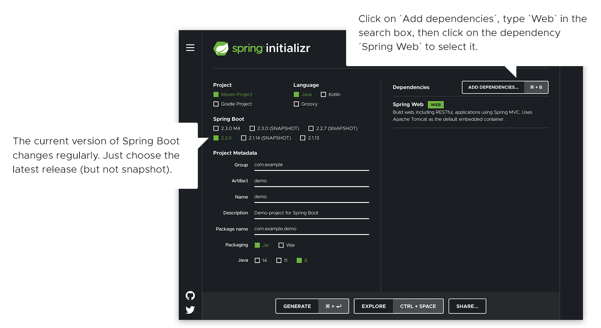
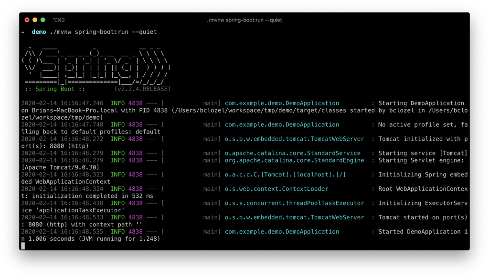
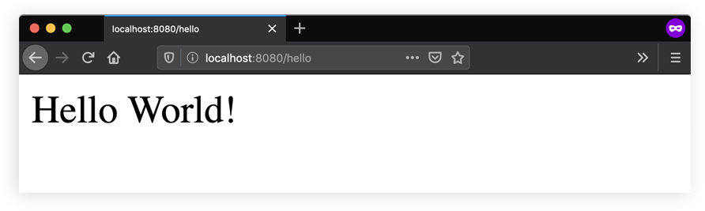

# SPRING BOOT

- [SPRING BOOT](#spring-boot)
  - [REFERENCIAS](#referencias)
  - [DESCRIPCIÓN GENERAL](#descripción-general)
  - [GUÍA DE INICIO RÁPIDO](#guía-de-inicio-rápido)
    - [Paso 1: Iniciar un nuevo proyecto Spring Boot](#paso-1-iniciar-un-nuevo-proyecto-spring-boot)
    - [Paso 2: Agrega tu código](#paso-2-agrega-tu-código)
    - [Paso 3: Pruébalo](#paso-3-pruébalo)
  - [ESTRUCTURA DE DIRECTORIOS](#estructura-de-directorios)

## REFERENCIAS
https://spring.io/projects/spring-boot

## DESCRIPCIÓN GENERAL

Spring Boot facilita la creación de aplicaciones independientes basadas en Spring y de nivel de producción que puedes "simplemente ejecutar".

Tenemos una visión objetiva de la plataforma Spring y las bibliotecas de terceros para que puedas empezar sin complicaciones. La mayoría de las aplicaciones Spring Boot requieren una configuración mínima de Spring.

**Características**

- Crear aplicaciones Spring independientes
- Incruste Tomcat, Jetty o Undertow directamente (sin necesidad de implementar archivos WAR)
- Proporcionar dependencias de "inicio" con opiniones para simplificar la configuración de compilación
- Configurar automáticamente Spring y bibliotecas de terceros siempre que sea posible
- Proporcionar funciones listas para producción, como métricas, controles de estado y configuración externalizada.
- No requiere generación de código y no requiere configuración XML

## GUÍA DE INICIO RÁPIDO

**Lo que construirás**: 
Crearás un endpoint clásico de **"¡Hola Mundo!"** al que cualquier navegador podrá conectarse. Incluso puedes decirle tu nombre y responderá de forma más intuitiva.

**Lo que necesitarás:** 
- Un entorno de desarrollo integrado (IDE)
Las opciones populares incluyen **IntelliJ** IDEA, **Visual Studio Code** con Paquete de extensión Spring Boot, o **Eclipse** conHerramientas de resorte.

- Un **kit de desarrollo de Java**™ (JDK)
RecomendamosJDK de BellSoft Libericaversión 17 o 21.

### Paso 1: Iniciar un nuevo proyecto Spring Boot
Usar [start.spring.io](https://start.spring.io/) Para crear un proyecto web, en el cuadro de diálogo "Dependencias", busque y agregue la dependencia "web" como se muestra en la captura de pantalla. Presione el botón "Generar", descargue el archivo zip y descomprímalo en una carpeta de su computadora.



Proyectos creados por [start.spring.io](https://start.spring.io/) contienen un framework Spring Boot que prepara Spring para funcionar en tu aplicación, sin necesidad de mucho código ni configuración. Spring Boot es la forma más rápida y popular de iniciar proyectos Spring.

### Paso 2: Agrega tu código

Abra el proyecto en su IDE y localice el archivo `DemoApplication.java` en la carpeta ``src/main/java/com/example/demo`` . Ahora modifique el contenido del archivo añadiendo el método y las anotaciones adicionales que se muestran en el código a continuación. Puede copiar y pegar el código o simplemente escribirlo.

````java
package com.example.demo;
import org.springframework.boot.SpringApplication;
import org.springframework.boot.autoconfigure.SpringBootApplication;
import org.springframework.web.bind.annotation.GetMapping;
import org.springframework.web.bind.annotation.RequestParam;
import org.springframework.web.bind.annotation.RestController;

@SpringBootApplication
@RestController
public class DemoApplication {
    public static void main(String[] args) {
      SpringApplication.run(DemoApplication.class, args);
    }
    @GetMapping("/hello")
    public String hello(@RequestParam(value = "name", defaultValue = "World") String name) {
      return String.format("Hello %s!", name);
    }
}
````
Este es todo el código necesario para crear un servicio web simple “Hola mundo” en Spring Boot.

El método ``hello()`` que añadimos está diseñado para tomar un parámetro de cadena llamado nombre y combinarlo con la palabra ``"Hello"`` en el código. Esto significa que si se especifica el nombre ``"Amy"`` en la solicitud, la respuesta sería "Hola Amy".

La anotación ``@RestController`` indica a Spring que este código describe un punto final que debe estar disponible en la web. ``@GetMapping(“/hello”)`` Indica a Spring que use nuestro método ``hello()`` para responder a las solicitudes enviadas a la dirección ``http://localhost:8080/hello``. Finalmente, ``@RequestParam`` indica a Spring que espere un valor de nombre en la solicitud; si no está presente, usará la palabra ``"World"`` por defecto.

### Paso 3: Pruébalo

Construyamos y ejecutemos el programa. Abra una línea de comandos (o terminal) y navegue a la carpeta donde se encuentran los archivos del proyecto. Podemos compilar y ejecutar la aplicación con el siguiente comando:

En windows:
````bash
.\gradlew.bat bootRun
````
Deberías ver un resultado muy similar a esto:


Las últimas líneas indican que Spring ha comenzado. El servidor Apache Tomcat integrado de Spring Boot actúa como servidor web y escucha las solicitudes en el puerto ``localhost:8080``. Abra su navegador y escriba ``http://localhost:8080/hello``. Debería obtener una respuesta amigable como esta:



## ESTRUCTURA DE DIRECTORIOS
